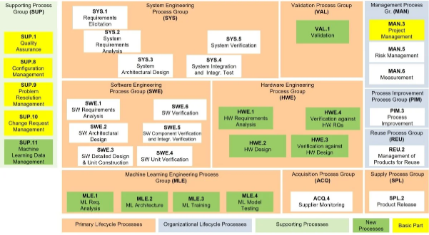
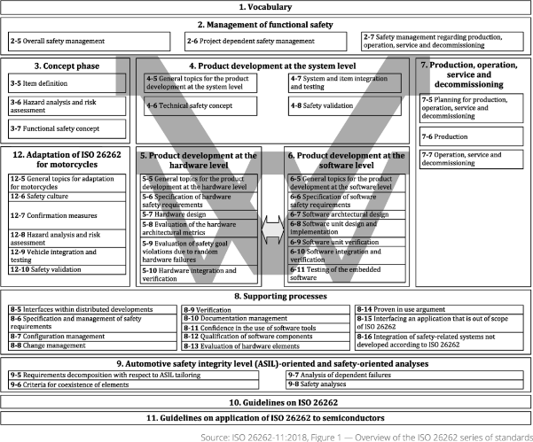

# ACC System Documents

새싹(SeSAC) AUTOSAR 기반 ACC(Adaptive Cruise Control) SW 개발 프로젝트

| 항목 | 내용 |
|------|------|
| **프로젝트명** | 1/10 스케일 RC카 기반 ACC 시스템 |
| **목적** | AUTOSAR 기반 ACC SW 개발 프로세스 학습 및 포트폴리오 |
| **팀 규모** | 4명 |
| **프로젝트 기간** | ~ 2026.05.01 |
| **HW 플랫폼** | NXP TRK-MPC5606B, Arduino, Raspberry Pi 5 |
| **적용 표준** | Automotive SPICE 4.0 + ISO 26262:2018 |

---

## 주요 기능 요구사항

- 전방 차량 인식 후 거리/속도 자동 제어 SWC 구현
- 시간 기반 안전거리 모델 (Short/Medium/Long 3단계)
- ACC 상태 관리 (OFF → STANDBY → CRUISING/FOLLOWING)
- 운전자 오버라이드 (브레이크/액셀) 즉시 반응
- 고장 안전 (FAULT 시 모터 출력 0, 자연 감속)
- 통합 시나리오 테스트

---

## 하드웨어 구성

| 구성 요소 | 사양 | 역할 |
|-----------|------|------|
| 메인 ECU | NXP TRK-MPC5606B | ACC 제어 로직 (AUTOSAR) |
| 보조 MCU | Arduino | 모터 제어, 센서 인터페이스 |
| 호스트 | Raspberry Pi 5 | HMI GUI, 카메라 처리 |
| 거리 센서 | LiDAR | 전방 차량 거리 측정 |
| 카메라 | RPi Camera | 전방 차량 인식 |
| 통신 버스 | CAN | ECU 간 메시지 통신 |

---

## 개발 표준 적용

### Automotive SPICE 4.0



V-모델 전체 체인을 준수하여 설계~검증까지 추적성을 유지한다.

| 계층 | 프로세스 | 적용 수준 |
|------|----------|-----------|
| 시스템 | SYS.1~5 | 전체/부분 |
| 소프트웨어 | SWE.1~6 | 전체 적용 |
| 하드웨어 | HW.1~4 | 경량 적용 |
| 지원 | SUP.1/8/9/10 | 전체 적용 |

### ISO 26262:2018



HARA 결과 기반 ASIL 등급 (예상):

| Hazard ID | 시나리오 | ASIL |
|-----------|---------|------|
| H-01 | 의도치 않은 가속 | ASIL B |
| H-02 | 브레이크 미작동 | ASIL B |
| H-03 | 의도치 않은 급감속 | ASIL A |

1/10 스케일 RC카 특성(저속, 비공공도로, 직접 감독 환경)을 반영하여 양산 차량 대비 낮은 ASIL 등급을 적용한다.

---

## 디렉토리 구조

```
docs/
├── README.md                       # 이 파일
├── guide/
│   └── README.md                   # 표준 테일러링 선언서 (ASPICE + ISO 26262 적용 범위)
├── reqs/                           # 요구사항 명세 서브모듈 (StrictDoc .sdoc)
└── refs/                           # 참조 문서 (데이터시트, 스펙 등)
```

---

## 추적성 체인

```
[ISO 26262 안전 체인]
HARA → Safety Goal → FSC(FSR) → TSR → SwRS(안전) → 설계 → 코드 → 테스트 → Safety Case

[ASPICE V-모델 체인]
STK (SYS.1) → SYS (SYS.2) → 시스템 아키텍처 (SYS.3)
                                        ↓
                              SWR (SWE.1) → SW 아키텍처 (SWE.2) → 상세설계/구현 (SWE.3)
                                        ↓                                    ↓
                              SW 자격테스트 (SWE.6)  SW 통합테스트 (SWE.5)  단위검증 (SWE.4)
                                        ↓
                              시스템 통합테스트 (SYS.4) → 시스템 자격테스트 (SYS.5) → VAL.1
```

---

## 역할 분배

| 역할 | 담당 | 주요 책임 |
|------|------|-----------|
| 시스템 엔지니어 / PM | A | SYS.1~5, HARA, Safety Goal, FSC, TSR, 일정 관리 |
| SW 엔지니어 | B | SWE.1~6, AUTOSAR/베어메탈 구현, 단위/통합/자격 테스트 |
| HW 엔지니어 | C | HW.1~4 (경량), HSI, 보드 브링업, 시스템 통합 |
| 품질/안전 엔지니어 | D | SUP.1/8/9/10, Safety Plan, Safety Case, QA 감사 |

> 독립성 원칙: D가 A·B·C의 안전 산출물에 대해 Confirmation Review 수행 (ISO 26262 Part 2, 독립성 레벨 I1)

---

## 관련 문서

- [표준 테일러링 선언서](guide/README.md) — ASPICE/ISO 26262 적용 범위 및 산출물 목록
- [요구사항 명세](https://github.com/gaepo-japcho/ACC-reqs) — StrictDoc 기반 STK/SYS/SWR/HWR/SAF 요구사항
