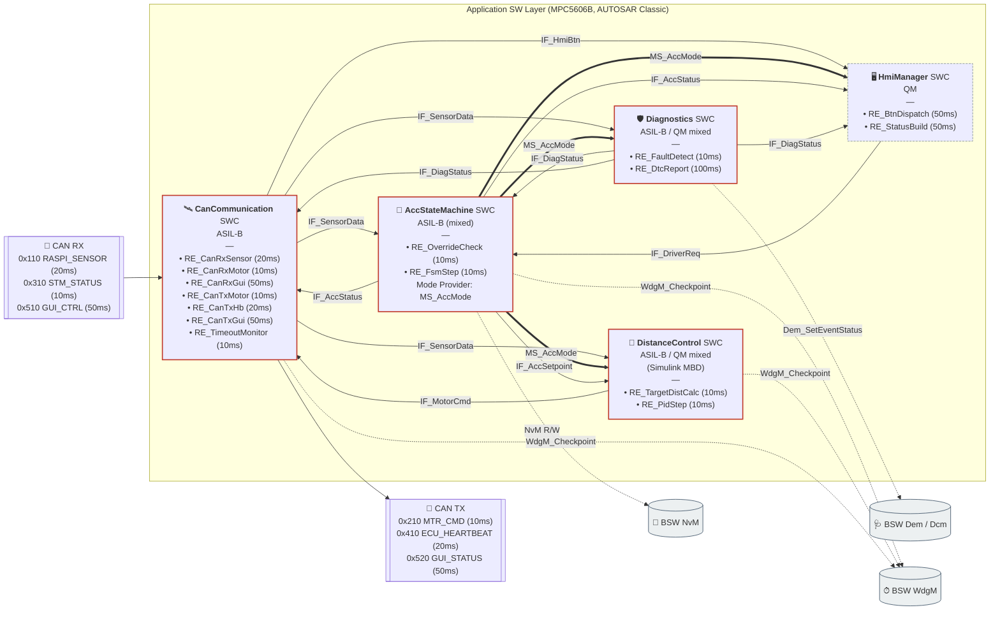
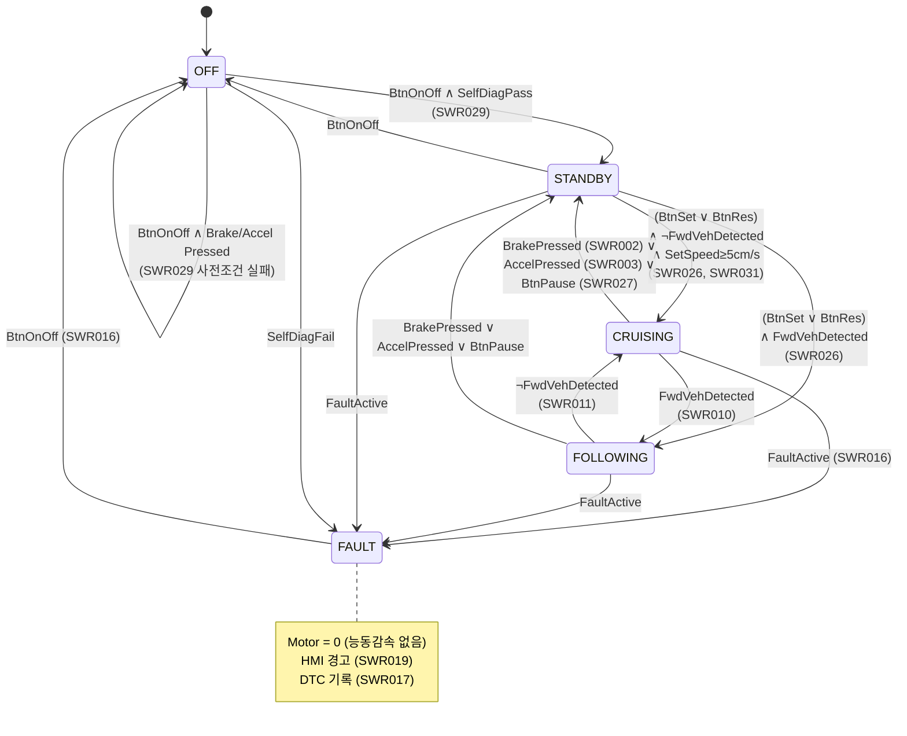
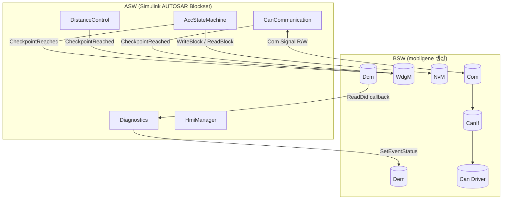

# ACC AUTOSAR Classic — Architecture Sketch (v0.2)

> **목적**: MATLAB AUTOSAR Blockset으로 모델링하기 전에 **SWC 구성 / Port / Interface / Runnable / RTE 연결**을 한 장에 확정.
> **대상 ECU**: NXP MPC5606B (AUTOSAR Classic 4.x)
> **툴체인**: MATLAB/Simulink + AUTOSAR Blockset → Embedded Coder → mobilgene(BSW/RTE config) → S32DS 빌드.
> **기준 요구사항**: `ACC-docs/reqs/STK/SYS/SWR.sdoc` (SWR001–SWR031, SWR005/006 삭제됨)
> **버전**: v0.2 (2026-04-20, v0.1의 SWR ID 오류·지어낸 항목 정정)

---

## 0. v0.1 → v0.2 변경 요약

| 변경 | 사유 |
|---|---|
| SWR005(디바운싱) / SWR006(MA 필터) **삭제** | 사용자 결정 — RPi에서 퓨전 완료, ECU 쪽 필터링 불필요 + 5/1 데드라인 |
| **SensorProcessing SWC 제거** (6 → 5 SWC) | SWR005/006 삭제 후 남은 SWR004/007 역할이 SWR015(CanComm 타임아웃 감시)와 중복 → 흡수 |
| SWR ID 전면 정정 | v0.1의 SWR ID는 상당수가 틀려 있었음 (원문 직접 확인) |
| ASIL 정정 | SWR003 액셀 오버라이드 QM, SWR009 PID QM, SWR010 CRUISE QM 등 원문 반영 |
| 태스크 주기 재정렬 | SWR021/022/023 원문 기준 → **10ms / 20ms / 50ms / 100ms** |
| `FusionValid` 필드, "퓨전 신뢰도 전파" 항목 삭제 | 원문에 없는 내용 (v0.1 작성자 추측) |

---

## 1. Top-level Composition (5 SWC)



**왜 CanComm이 ASIL-B로 승격되었나?**
SWR004(LiDAR 타임아웃, ASIL-B), SWR015(CAN 타임아웃 감시, ASIL-B), SWR002(브레이크 버튼 수신, ASIL-B) 이 셋이 모두 CAN 경로를 통과하므로, CanComm을 ASIL-B 파티션에 둬야 안전 체인이 끊기지 않음. SensorProcessing 제거의 대가로 이 SWC의 ASIL이 올라간 것.

---

## 2. 인터페이스 카탈로그

### 2.1 Sender-Receiver Interfaces

| Interface | Data Elements | Init | 생산 | 소비 | 근거 SWR |
|---|---|---|---|---|---|
| **IF_SensorData** | FwdDistanceCm : uint8<br/>FwdVehicleDetected : boolean<br/>RelVelocityCmS : sint16<br/>EgoSpeedCmS : uint16<br/>RaspiErrCode : uint8<br/>StmErrCode : uint8<br/>SensorTimeoutFlag : boolean<br/>MotorTimeoutFlag : boolean | 0xFF / FALSE / 0 / 0 / 0 / 0 / FALSE / FALSE | CanComm | FSM, DistCtl, Diag | SWR004, SWR007, SWR013, SWR014, SWR015 |
| **IF_AccSetpoint** | SetSpeedCmS : uint16<br/>DistanceLevel : DistLevel_T<br/>CtrlMode : CtrlMode_T | 0 / LEVEL3 / DISABLED | FSM | DistCtl | SWR010, SWR011, SWR031 |
| **IF_AccStatus** | AccState : AccState_T<br/>SetSpeedCmS : uint16<br/>DistanceLevel : DistLevel_T<br/>BtnAvailability : uint8 | OFF / 0 / LEVEL3 / 0 | FSM | Hmi, CanComm | SWR001, SWR028 |
| **IF_DriverReq** | BtnOnOff : boolean<br/>BtnSet : boolean<br/>BtnRes : boolean<br/>BtnPause : boolean<br/>DistLevelReq : DistLevel_T<br/>SetSpeedReq : uint16<br/>BrakePressed : boolean<br/>AccelPressed : boolean | FALSE × 4 / LEVEL3 / 0 / FALSE × 2 | Hmi | FSM | SWR002, SWR003, SWR026, SWR027, SWR020 |
| **IF_MotorCmd** | TargetPwmDuty : sint16<br/>TargetSpeedCmS : uint16<br/>CmdValid : boolean | 0 / 0 / FALSE | DistCtl | CanComm | SWR009, SWR012 |
| **IF_DiagStatus** | FaultActive : boolean<br/>FaultCode : FaultCode_T<br/>FaultSource : FaultSrc_T | FALSE / NO_FAULT / NONE | Diag | FSM, Hmi, CanComm | SWR016 |
| **IF_HmiBtn** | RawBtnBitmap : uint8<br/>DistLevelReq : DistLevel_T<br/>SetSpeedReq : uint16<br/>GuiSeqCounter : uint8 | 0 / LEVEL3 / 0 / 0 | CanComm | Hmi | SWR020, SWR030 |

### 2.2 Client-Server Interfaces (BSW 서비스)

| Interface | Operation | Client | Server | 근거 |
|---|---|---|---|---|
| **CS_Dem** | `SetEventStatus(EventId, Status)` | Diag | Dem | SWR017 |
| **CS_WdgM** | `CheckpointReached(SupId, CpId)` | FSM / DistCtl / CanComm | WdgM | ISO 26262 안전 메커니즘 |
| **CS_Dcm_Custom** | `ReadDid_F1A0_AccVer` | Dcm | Diag | SWR017 |
| **CS_NvM** | `WriteBlock / ReadBlock` | FSM | NvM | SWR002 (보존), SWR026 (복원) |

### 2.3 Mode-Switch Interface

| Interface | Mode Group | Modes | Provider | Users |
|---|---|---|---|---|
| **MS_AccMode** | `MDG_AccMode` | OFF, STANDBY, CRUISING, FOLLOWING, FAULT | AccStateMachine | DistanceControl, HmiManager, Diagnostics |

---

## 3. DataType & Enum 카탈로그

### 3.1 Enum (CompuMethod: TEXTTABLE)

```text
AccState_T : uint8
  0 = ACC_OFF
  1 = ACC_STANDBY
  2 = ACC_CRUISING
  3 = ACC_FOLLOWING
  4 = ACC_FAULT

DistLevel_T : uint8
  1 = LEVEL1   (THW=0.8s)
  2 = LEVEL2   (THW=1.2s)
  3 = LEVEL3   (THW=1.6s, 기본값 SWR029)

CtrlMode_T : uint8
  0 = CTRL_DISABLED
  1 = CTRL_SPEED      (CRUISING, SWR010)
  2 = CTRL_DISTANCE   (FOLLOWING, SWR011)

FaultCode_T : uint16
  0x0000 = NO_FAULT
  0x0101 = ERR_SENSOR_TIMEOUT   (SWR004)
  0x0102 = ERR_SENSOR_RPI       (ERR_SENSOR≠0)
  0x0201 = ERR_MOTOR_TIMEOUT    (SWR007)
  0x0202 = ERR_MOTOR_STM        (ERR_MTR≠0)
  0x0301 = ERR_ECU              (ERR_ECU≠0)
  0x0302 = ERR_ECU_WDG

FaultSrc_T : uint8
  0 = NONE, 1 = SENSOR_RPI, 2 = MOTOR_STM, 3 = ECU_SELF
```

### 3.2 Physical Scaling (CompuMethod: LINEAR)

| AppType | ImplType | Factor | Offset | Unit |
|---|---|---|---|---|
| DistanceCm | uint8 | 1 | 0 | cm (SWR004 원문 8-bit) |
| SpeedCmS | uint16 | 1 | 0 | cm/s |
| RelSpeedCmS | sint16 | 1 | 0 | cm/s |
| PwmDuty | sint16 | 0.01 | 0 | % |

### 3.3 Inter-Runnable Variables (DistanceControl 내부)

| IRV | Type | 용도 |
|---|---|---|
| `Irv_PidIntegrator` | float32 | PID 적분항 (anti-windup, SWR009) |
| `Irv_PidPrevError` | float32 | 미분항 계산용 직전 오차 |
| `Irv_LastTargetDist` | uint16 | 모드 전환 시 bump-less 연결 |

---

## 4. SWC별 상세

### 4.1 AccStateMachine (ASIL-B)

| Port | Dir | Interface | 근거 |
|---|---|---|---|
| PP_AccStatus | Provide | IF_AccStatus | SWR001, SWR028 |
| PP_AccSetpoint | Provide | IF_AccSetpoint | SWR010, SWR011 |
| PP_AccMode | Provide (Mode) | MS_AccMode | (설계) |
| RP_SensorData | Require | IF_SensorData | SWR001 (전방차 기반 전이) |
| RP_DriverReq | Require | IF_DriverReq | SWR002/003/026/027 |
| RP_DiagStatus | Require | IF_DiagStatus | SWR016 |
| RP_NvM | Require (C-S) | CS_NvM | SWR002 (설정 보존) |
| RP_WdgM | Require (C-S) | CS_WdgM | 안전 |

**Runnables**
- `RE_OverrideCheck` (10ms, **우선순위 최상**) — 브레이크(ASIL-B, SWR002) / 액셀(QM, SWR003) edge 감지 → 즉시 STANDBY. 10ms 태스크 내 최초 실행으로 50ms 제약 보장.
- `RE_FsmStep` (10ms) — SWR001 상태 전이 평가. OverrideCheck 직후 실행.

### 4.2 DistanceControl (Simulink MBD, ASIL-B / QM mixed)

| Port | Dir | Interface | 근거 |
|---|---|---|---|
| PP_MotorCmd | Provide | IF_MotorCmd | SWR009, SWR012 |
| RP_SensorData | Require | IF_SensorData | SWR008 (거리 계산 입력) |
| RP_AccSetpoint | Require | IF_AccSetpoint | SWR010/011 |
| RP_AccMode | Require (Mode) | MS_AccMode | 모드별 동작 분기 |
| RP_WdgM | Require (C-S) | CS_WdgM | 안전 |

**Runnables**
- `RE_TargetDistCalc` (10ms) — **SWR008**: `d_target = THW × EgoSpeed` (THW는 DistLevel에 따라 0.8/1.2/1.6s). AEB는 없음.
- `RE_PidStep` (10ms) — **SWR009/010/011**: CtrlMode=SPEED면 속도 PID, CtrlMode=DISTANCE면 거리 PID. anti-windup 포함. MS_AccMode가 STANDBY/FAULT면 motor=0 출력.

> **ASIL mixed 이유**: SWR009/010은 QM이지만 SWR011(FOLLOWING 거리제어)은 ASIL-B. 동일 SWC 내 로직이라 안전하게 **전체를 ASIL-B 파티션에 둔다** (보수적 결정).

### 4.3 CanCommunication (ASIL-B)

| Port | Dir | Interface | 근거 |
|---|---|---|---|
| PP_SensorData | Provide | IF_SensorData | SWR004/007/013/014/015 |
| PP_HmiBtn | Provide | IF_HmiBtn | SWR020 |
| RP_MotorCmd | Require | IF_MotorCmd | SWR012 |
| RP_AccStatus | Require | IF_AccStatus | GUI_STATUS TX용 |
| RP_DiagStatus | Require | IF_DiagStatus | ECU_HEARTBEAT TX용 |
| RP_WdgM | Require (C-S) | CS_WdgM | 안전 |

**Runnables**
- `RE_CanRxSensor` (20ms, **SWR022**) — 0x110 RASPI_SENSOR 디코드 → IF_SensorData 일부 갱신
- `RE_CanRxMotor` (10ms) — 0x310 STM_STATUS 디코드 → IF_SensorData 일부 갱신 (EgoSpeed)
- `RE_CanRxGui` (50ms) — 0x510 GUI_CTRL 디코드 → IF_HmiBtn
- `RE_CanTxMotor` (10ms, **SWR012**) — IF_MotorCmd → 0x210 MTR_CMD 인코드
- `RE_CanTxHb` (20ms) — IF_DiagStatus → 0x410 ECU_HEARTBEAT
- `RE_CanTxGui` (50ms) — IF_AccStatus + IF_DiagStatus → 0x520 GUI_STATUS
- `RE_TimeoutMonitor` (10ms, **SWR004/007/015**) — 각 메시지별 타임아웃 카운터 관리, Timeout 시 SensorTimeoutFlag/MotorTimeoutFlag 세팅 + IF_DiagStatus 호환 데이터 제공 (실제 FAULT 전이는 Diag가 판단).

### 4.4 Diagnostics (ASIL-B / QM mixed)

| Port | Dir | Interface | 근거 |
|---|---|---|---|
| PP_DiagStatus | Provide | IF_DiagStatus | SWR016 |
| RP_SensorData | Require | IF_SensorData | timeout flag / err code 접근 |
| RP_AccMode | Require (Mode) | MS_AccMode | FAULT 시 동작 |
| RP_Dem | Require (C-S) | CS_Dem | SWR017 |
| PP_Dcm | Provide (C-S) | CS_Dcm_Custom | UDS callback |

**Runnables**
- `RE_FaultDetect` (10ms, **SWR016**) — ERR_SENSOR / ERR_MTR / ERR_ECU / Timeout 플래그 OR → FaultCode 결정 → IF_DiagStatus 갱신.
- `RE_DtcReport` (100ms, **SWR017/SWR023**) — Dem_SetEventStatus 호출, DTC 기록(유형/시각/횟수).

### 4.5 HmiManager (QM)

| Port | Dir | Interface | 근거 |
|---|---|---|---|
| PP_DriverReq | Provide | IF_DriverReq | SWR020 (수신 측) |
| RP_HmiBtn | Require | IF_HmiBtn | SWR020 |
| RP_AccStatus | Require | IF_AccStatus | SWR018 |
| RP_DiagStatus | Require | IF_DiagStatus | SWR019 |
| RP_AccMode | Require (Mode) | MS_AccMode | 버튼 그레이아웃 |
| RP_NvM | Require (C-S) | CS_NvM | boot 시 last value |

**Runnables**
- `RE_BtnDispatch` (50ms, **SWR018**) — IF_HmiBtn → edge detect → IF_DriverReq 생성. 브레이크/액셀은 edge 없이 즉시 pass-through.
- `RE_StatusBuild` (50ms, **SWR018/019**) — 현재 Mode + 진단 상태 → IF_AccStatus / IF_DiagStatus 기반으로 GUI 표시용 번들.

> **주의**: SWR018은 HMI 50ms 주기, SWR023은 HMI/DTC/진단 100ms 주기로 **문구상 충돌**. HMI 표시 응답성은 50ms가 운전자 체감에 중요하므로 **HMI = 50ms, DTC 로깅 = 100ms**로 분리. SYS 요구사항 수정 제안이 필요하면 이후 논의.

---

## 5. OS Task 스케줄링

**요구사항 근거**: SWR021(10ms 제어+안전), SWR022(20ms 센서 수신), SWR018(50ms HMI), SWR023(100ms DTC/진단)

| OsTask | 우선순위 | 주기 | Runnable 실행 순서 | 파티션 |
|---|---|---|---|---|
| **Task_10ms** | 최고 | 10ms | AccFsm.RE_OverrideCheck → AccFsm.RE_FsmStep → DistCtl.RE_TargetDistCalc → DistCtl.RE_PidStep → CanComm.RE_CanRxMotor → CanComm.RE_TimeoutMonitor → Diag.RE_FaultDetect → CanComm.RE_CanTxMotor | ASIL-B |
| **Task_20ms** | 상 | 20ms | CanComm.RE_CanRxSensor → CanComm.RE_CanTxHb | ASIL-B |
| **Task_50ms** | 중 | 50ms | CanComm.RE_CanRxGui → Hmi.RE_BtnDispatch → Hmi.RE_StatusBuild → CanComm.RE_CanTxGui | QM |
| **Task_100ms** | 하 | 100ms | Diag.RE_DtcReport | QM |

> **Task_10ms 순서 고정 이유**: OverrideCheck → FsmStep이 먼저 돌아야 브레이크를 밟은 순간에 STANDBY 전이가 되고, 같은 10ms 틱에서 DistCtl이 MS_AccMode=STANDBY를 읽어 motor=0을 출력한다. 순서가 역전되면 최소 10ms 지연 발생 → SWR002 50ms 한계에 근접 위험.

---

## 6. 상태 머신 (AccStateMachine 내부)



---

## 7. CAN ↔ RTE 시그널 맵핑

| CAN ID | 이름 | Dir | Period | 주요 시그널 | ASW Port |
|---|---|---|---|---|---|
| **0x110** | RASPI_SENSOR | RPi→ECU | 20ms | VEH_DETECT, VEH_DIST(8b cm), REL_VEL(16b cm/s), ERR_SENSOR | CanComm RX |
| **0x210** | MTR_CMD (제안) | ECU→Arduino | 10ms | TargetPwmDuty, TargetSpeed, CmdValid, (선택)E2E_CRC8+RC | CanComm TX |
| **0x310** | STM_STATUS | Arduino→ECU | 10ms | EgoSpeedCmS, MtrStatus, ERR_MTR | CanComm RX |
| **0x410** | ECU_HEARTBEAT | ECU→all | 20ms | HbCounter, FaultCode, ERR_ECU | CanComm TX |
| **0x510** | GUI_CTRL | RPi(GUI)→ECU | 50ms | BtnBitmap, DistLvlReq, SetSpdReq, BrakePressed, AccelPressed, GuiSeq | CanComm RX |
| **0x520** | GUI_STATUS | ECU→RPi(GUI) | 50ms | AccState, SetSpd, DistLvl, EgoSpd, FaultCode, BtnAvailability | CanComm TX |

> **E2E**: MTR_CMD만 P01 (CRC8 + RollingCounter) 적용. Arduino는 AUTOSAR 미적용이므로 동일 CRC8 polynomial을 수동 구현.
> **CAN 메시지 개수**: GUI 양방향을 각각 세면 6개. SYS 요구사항은 "5개"로 적혀 있는데, GUI를 한 묶음으로 센 숫자로 보임 → 설계는 6개 유지.

---

## 8. BSW 서비스 계약



---

## 9. MATLAB AUTOSAR Blockset 구현 순서

### Step 1 — AUTOSAR Dictionary 사전 등록 (0.5일)
1. `autosar.dictionary.create('ACC_Types.sldd')`
2. Application Data Types (§3.1 enum 4개 + §3.2 Linear 4개)
3. Implementation Data Types (uint8/uint16/sint16/boolean/float32)
4. Sender-Receiver Interfaces **7개** (§2.1)
5. Client-Server Interfaces **4개** + Mode-Switch Interface **1개**

### Step 2 — SWC Atomic 모델 생성 (1일 × 5 = 5일)
SWC 하나당 `.slx` 하나.
1. Blank AUTOSAR Model 템플릿 → `ACC_Types.sldd` reference.
2. Config Params → AUTOSAR Classic, 4.x.
3. AUTOSAR Component Designer로 §4 표대로 Port 추가.
4. Runnables 탭에서 이름/주기/트리거 등록.
5. 내부는 Constant 블록으로 dummy 연결 → 빌드 확인.

**순서**: AccStateMachine → DistanceControl → CanCommunication → Diagnostics → HmiManager.

### Step 3 — Composition 모델 생성 (0.5일)
1. `Composition.slx` 에 5 SWC를 AUTOSAR Component Block으로 인스턴스화.
2. §1 다이어그램대로 포트 간 라인 연결.
3. Delegation Port — CAN 시그널, Dem/WdgM/NvM/Dcm 서비스.

### Step 4 — ARXML Export & mobilgene 연동 (0.5일)
1. `export('ACC_Composition.arxml')`.
2. mobilgene에서 BSW (Com/CanIf/Dem/Dcm/WdgM/NvM/BswM) config.
3. §7 CAN ↔ Com 시그널 매핑.
4. §5 OsTask 스케줄 설정.

### Step 5 — Embedded Coder 빌드 (0.5일)
1. Composition → C 코드 생성.
2. RTE.c / BSW 와 머지 → S32DS로 컴파일.
3. 플래싱 후 0x410 ECU_HEARTBEAT 주기 확인 = AUTOSAR 골격 동작.

### Step 6 — DistanceControl 내부 로직 (3–5일, 팀원 1명 풀타임)
- `RE_TargetDistCalc`: `d_target = THW(DistLevel) × EgoSpeed` (SWR008).
- `RE_PidStep`: 이산 PID + back-calculation anti-windup (SWR009).
- MS_AccMode에 따라 Speed/Distance 분기 (Multiport Switch).
- Simulink Test Harness로 SWR008/009/010/011 단위 테스트.

### Step 7 — 통합 테스트 (5일)
- HIL: CAN 시뮬레이터로 0x110/0x310/0x510 주입.
- 시나리오: ACC ON → CRUISING → 전방차 출현 → FOLLOWING → 브레이크 → STANDBY → FAULT 주입.

**팀 분담 (5명, 4/30까지)**
- 팀원 A: AccStateMachine + FSM 단위 테스트
- 팀원 B: DistanceControl + PID 튜닝 + Simulink 단위 테스트
- 팀원 C: CanCommunication + Diagnostics (CAN + DTC)
- 팀원 D: HmiManager + RPi GUI + 통합 시나리오
- 팀원 E: (역할 TBD)

---

## 10. 요구사항 ↔ 설계 Traceability

| SWR | 내용 | ASIL | SWC | 구현 위치 |
|---|---|---|---|---|
| SWR001 | 5-상태 FSM | B | AccStateMachine | RE_FsmStep + §6 상태도 |
| SWR002 | 브레이크 오버라이드 50ms | B | AccStateMachine | RE_OverrideCheck (10ms, 우선순위↑) |
| SWR003 | 액셀 오버라이드 | QM | AccStateMachine | RE_OverrideCheck |
| SWR004 | LiDAR 거리 + 60ms 타임아웃 + ERR_SENSOR | B | CanCommunication | RE_CanRxSensor + RE_TimeoutMonitor |
| SWR007 | 자차속도 수신 + 타임아웃 | QM | CanCommunication | RE_CanRxMotor + RE_TimeoutMonitor |
| SWR008 | 안전거리 (AEB 없음) | B | DistanceControl | RE_TargetDistCalc |
| SWR009 | PID + anti-windup | QM | DistanceControl | RE_PidStep |
| SWR010 | CRUISE 속도제어 | QM | DistanceControl | RE_PidStep (SPEED 모드) |
| SWR011 | FOLLOWING 거리제어 | B | DistanceControl | RE_PidStep (DISTANCE 모드) |
| SWR012 | CAN TX 모터명령 | QM | CanCommunication | RE_CanTxMotor |
| SWR013 | CAN RX 센서 (20ms / 60ms timeout) | QM | CanCommunication | RE_CanRxSensor |
| SWR014 | CAN RX 모터피드백 (10ms / 30ms timeout) | QM | CanCommunication | RE_CanRxMotor |
| SWR015 | CAN 타임아웃 감시 + ERR 모니터 | B | CanCommunication | RE_TimeoutMonitor |
| SWR016 | FAULT 전이 (능동감속 없음) | B | Diagnostics | RE_FaultDetect |
| SWR017 | DTC 관리 | QM | Diagnostics | RE_DtcReport + CS_Dem |
| SWR018 | HMI 표시 50ms | QM | HmiManager | RE_StatusBuild |
| SWR019 | FAULT 경고 표시 | QM | HmiManager | RE_StatusBuild |
| SWR020 | 운전자 입력 GUI→CAN | QM | (DriverInput, RPi — AUTOSAR 범위 밖) | RPi Python |
| SWR021 | 10ms 태스크 | B | AUTOSAR_OS | Task_10ms |
| SWR022 | 20ms 태스크 | QM | AUTOSAR_OS | Task_20ms |
| SWR023 | 100ms 태스크 | QM | AUTOSAR_OS | Task_100ms (DTC), HMI는 50ms로 분리 |
| SWR024 | MISRA-C:2012 | B | All | 정적분석 (Polyspace/LDRA) |
| SWR025 | AUTOSAR RTE 포트 정의 | QM | All | 이 문서 §2 전체 |
| SWR026 | SET/RES 버튼 | QM | AccStateMachine | RE_FsmStep |
| SWR027 | 일시정지 버튼 | QM | AccStateMachine | RE_FsmStep |
| SWR028 | 버튼 가용성 관리 | QM | AccStateMachine + HmiManager | IF_AccStatus.BtnAvailability |
| SWR029 | ACC ON 자가진단 | B | AccStateMachine | RE_FsmStep (OFF→STANDBY guard) |
| SWR030 | GUI CAN 인터페이스 | QM | (GuiCanInterface, RPi — AUTOSAR 범위 밖) | RPi Python |
| SWR031 | 최소 설정 속도 5cm/s | QM | AccStateMachine | RE_FsmStep clamp |

> **삭제된 SWR**: SWR005(디바운싱), SWR006(MA 필터) — v0.2에서 요구사항 자체가 삭제됨.
> **AUTOSAR 범위 밖 SWR**: SWR020, SWR030 — RPi에서 Python으로 구현.

---

## 11. 열린 이슈

1. **MTR_CMD CAN ID = 0x210** — 제안값, DBC 확정 필요.
2. **CAN 메시지 개수 5 vs 6** — SYS 요구사항 "5"는 GUI 양방향을 한 묶음으로 센 숫자. 설계는 6개. SYS.sdoc 문구 정정 제안.
3. **HMI 주기 50ms vs 100ms** — SWR018(50ms)과 SWR023(100ms) 충돌. 설계는 HMI=50ms + DTC=100ms로 분리.
4. **LiDAR vs Radar** — 1/10 스케일에서는 LiDAR 유지 권장 (TF-Luna/TF-Mini 계열).
5. **E2E 적용 범위** — 현재는 MTR_CMD만 P01. 다른 메시지(특히 GUI_CTRL의 BrakePressed/AccelPressed)에도 P01을 씌울지 팀 미팅 결정 필요.
6. **DistCtl ASIL** — 로직상 ASIL-B(SWR011)와 QM(SWR009/010)이 혼재. 보수적으로 전체 ASIL-B 파티션 적용 중. 코드 사이즈·인증 비용 이슈가 되면 내부 함수 단위로 분리 검토.
7. **Simulink "DriverInput" 블록** — SWR020의 ECU 수신 측 책임을 HmiManager가 흡수했는데, 향후 GPIO 기반 물리 브레이크 페달을 ECU가 직접 읽게 되면 별도 SWC 분리 검토.
